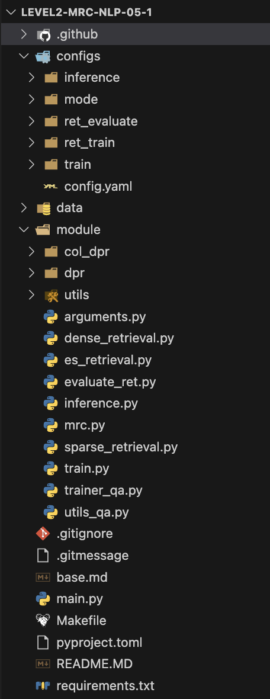

# level 2. Open-Domain Question Answering (RAG)

 

# 🔎 프로젝트 소개

    

| **개요** | **설명** |
| --- | --- |
| **주제** |  주어진 질문에 대해 정해진 지문이 없이 사전에 구축되어 있는 Knowledge resource에서   질문에 대한 답변을 찾는 과정 |
| **데이터셋** | **train_dataset** train: 3,952, validation: 240   **test_dataset** validation: 240(public), 360(private)   **wikipedia_documents** 60,613 |
| **평가** | • **두 가지 평가지표**를 사용(EM 기준으로 반영되고, F1은 참고용으로만 활용)   • **Exact Match**(EM): 모델의 예측과, 실제 답이 정확하게 일치할 때만 점수가 주어진다.   • **F1 Score**: EM과 다르게 겹치는 단어도 있는 것을 고려해 부분 점수를 제공한다. |
| **개발 환경** | **`GPU`**: Tesla V100 Sever 4대, **`IDE`**: Vscode, Jupyter Notebook |

 

# 👨🏻‍💻 팀원 소개 및 역할

  
|권유진 |박무재 |박정미 |이용준 |정원식 |
|:-:|:-:|:-:|:-:|:-:|
|</img>|</img>|</img>|</img>|</img>|
|Retriever 모델(BM25, TF-IDF+BM25) 구현|Retriever 모델(DPR) 구현 및 모듈화, negative sampling 구현, 앙상블|EDA, 데이터 전처리, KorQuAD 데이터 증강|PM, base-code 모듈화 및 환경세팅, Colbert 구현, elastic-search 구현, 실험 및 앙상블|Reader 모델 리서치, 모델 실험, Hyperparameter tuning|

  

# 📊 탐색적 분석 및 전처리

### 탐색적 분석

- 데이터 분포 및 특성 분석

### 전처리

- 기타 특수문자 및 개행문자 제거
- 중복된 context 제거

### 데이터 증강

- KorQuAD 1.0
    - train: 64,359개 / validation: 6,014개
- KorQuAD 2.1
    - train: 124,240개 / validation: 17,551개

### 데이터 버전

| **Data Version** | **버전 설명** |
| --- | --- |
| **v1** | 기타 특수문자를 공백으로 변환 |
| **v2** | 기타 특수문자 및 개행문자, wikipedia의 중복된 context 제거 |
| **v3** | KorQuAD 1.0 추가(+ v2와 동일한 전처리) |
| **v4** | KorQuAD 1.0과 KorQuAD 2.1로만 구성(+ v2와 동일한 전처리) |

 

# ⚒️ 개발

### 프로젝트 구조

  

  사용한 모델: TF-IDF, BM25, TF-IDF + BM25, Elastic Search |
|  | **Dense** | 딥러닝 기반 임베딩 모델(Bert)을 활용하여 문서와 쿼리를 밀집 벡터 공간에 매핑한 후, 이 벡터들 간의 유사도를 계산하여 가장 관련성 높은 문서를 찾는다.    사용한 모델: klue/bert-base, klue/roberta(base, large)    모델 구조: Cross-Attention Encoder, Dual-Encoder, Colbert |
| **Reader** |  | 사용한 모델: klue/bert-base, monologg/koelectra-base-v3-discriminator, klue/roberta-large, DHBaek/xlm-roberta-large-korquad-mask, hanmaroo/xlm_roberta_large_korquad_v1, team-lucid/deberta-v3-xlarge-korean |

### 개선 아이디어

| **분류** |  | **내용** |
| --- | --- | --- |
| **Retrieval** | **Sparse** | **TF-IDF + BM25**: TF-IDF로 전체적인 단어 빈도 기반의 유사도를 구하고, BM25의 가중치를 추가하여 문서의 길이와 빈도를 보정   **Re-Ranking**: Sparse 를 이용해 후보 Passage를 정하고 Dense Retrieval로 다시 ranking하는 방법을 적용 |
|  | **Dense** | **Hard negative sampling**: BM25를 통해 질문과 지문들을 scoring하여 top-n개의 지문을 negative로 활용   **Gradient accumulation**: 여러 미니 배치의 그라디언트를 누적해 마치 큰 Batch size로 학습하는 효과   **Gradient cache**: in-batch 효과를 살릴 수 있는 방법   **Mixed precision**: 모델 파라미터의 일부를 16-bit로 처리하여 메모리 사용량을 줄이고, 학습 속도를 높이는 방식   **Colbert**: late interaction이란 아이디어를 이용해 bi-encoder와 cross-encoder 두 가지 설계의 장점을 취할 수 있음 |
| **Reader** |  | **Curriculum Learning**: 데이터셋의 순서를 조정하여 모델이 학습하기 어려운것을 뒤로 배치하여 모델이 점차적으로 학습하여 성능을 개선시키기 위한 방법론 |

# 💥 실험 및 결과

### 모델 성능 및 선정

- **Retrieval** 성능
    
    
    |  | **TF-IDF** | **BM25** | **TF-IDF + BM25** | **klue/bert-base(1epoch)** |
    | --- | --- | --- | --- | --- |
    | Top_1 | 26.45 | 54.68 | 37.66 | 24.52 |
    | **Top_10** | **65.56** | **88.71** | **79.76** | 51.69 |
    | Top_20 | 73.55 | 91.94 | 86.45 | 59.03 |
    | Top_30 | 78.23 | 93.55 | 89.27 | 63.23 |
    | Top_40 | 81.05 | 94.44 | 90.73 | 66.21 |
    | Top_50 | 83.63 | 95.16 | 91.53 | 67.98 |
    | Top_100 | 88.55 | 96.05 | 94.35 | 75.48 |
- **Reader** 성능
    - 모델별 EM, F1 Score 비교
        
        
        | Reader | EM | F1 | Epoch | Batch size |
        | --- | --- | --- | --- | --- |
        | klue/bert-base | 59.833 | 69.641 | 15 | 24 |
        | monologg/koelectra-base-v3-discriminator | 56.250 | 65.864 | 15 | 24 |
        | **klue/roberta-large** | **69.583** | **77.280** | 1 | 24 |
        | team-lucid/deberta-v3-xlarge-korean | 56.250 | 66.563 | 1 | 8 |
        | hanmaroo/xlm_roberta_large_korquad_v1 | 57.083 | 67.490 | 1 | 20 |
        | DHBaek/xlm-roberta-large-korquad-mask | 58.333 | 68.427 | 1 | 20 |
    - max_seq_length, doc_stride에 따른 비교
        
        
        | Model name | EM | F1 | max_seq_length | doc_stride | doc_stride/max_seq_length |
        | --- | --- | --- | --- | --- | --- |
        | **klue/bert-base** | **59.833** | **69.641** | **384** | **128** | **0.333333333** |
        | klue/bert-base | 57.083 | 65.419 | 512 | 128 | 0.25 |
        | klue/bert-base | 59.583 | 68.521 | 512 | 256 | 0.5 |
    - n_best_size에 따른 비교
        
        
        | Model name | EM | F1 | n_best_size | EM 개선율(%) |
        | --- | --- | --- | --- | --- |
        | klue/bert-base | 59.833 | 69.641 | 20 | - |
        | **klue/bert-base** | **60.12** | **67.537** | **40** | **0.48** |
    - no_answer 토큰 추가에 따른 비교
        
        
        | Model name | EM | F1 | no_answer 토큰 추가 | null_score_diff_threshold | EM 개선율(%) |
        | --- | --- | --- | --- | --- | --- |
        | **klue/bert-base** | **59.833** | **69.641** | **X** | - | - |
        | klue/bert-base | 58.333 | 65.766 | O | 0 | -2.506 |
        | klue/bert-base | 58.333 | 65.766 | O | 1 | -2.506 |
        | klue/bert-base | 58.333 | 65.766 | O | 5 | -2.506 |
    - LoRA 사용에 따른 비교
        
        
        | Model name | EM | F1 | LoRA | EM 개선율(%) |
        | --- | --- | --- | --- | --- |
        | **klue/bert-base** | **59.833** | **69.641** | **X** | **-** |
        | klue/bert-base | 56.25 | 66.213 | O | -5.988 |
    - 데이터 전처리에 따른 비교
        
        
        | Model name | EM | F1 | 데이터 전처리 | EM 개선율(%) |
        | --- | --- | --- | --- | --- |
        | klue/bert-base | 59.833 | 69.641 | X | - |
        | **klue/bert-base** | **61.25** | **68.583** | **O** | **2.368** |

- 앙상블 모델
    - Reader는 roberta-large 사용
        
        
        | Retrieval version | EM | F1 |
        | --- | --- | --- |
        | BM25+  | 60.4200 | 71.5300 |
        | BM25 + pretaining  | 57.9200 | 68.3600 |
        | Elastic Search | 59.1700 | 69.9300 |
        | Colbert | 54.1700 | 64.6800 |
        | BM25Okapi | 55.4200 | 65.0200 |

### 결과

- 리더보드 [중간 순위]

  

    
- 리더보드 [최종 순위]

  

